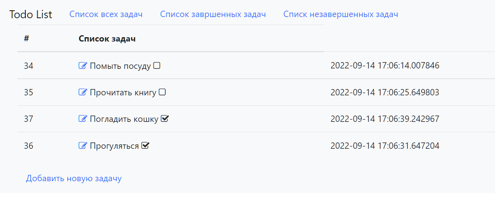

# job4j_todo

### СПИСОК ДЕЛ TODOLIST

Реализация списка дел на Spring boot, Thymeleaf, Bootstrap, Hibernate, PostgreSql.
В списке дел можно смотерть существующие задания, а также статус их выполнения. 
Также можно добавлять и удалять задачи.

